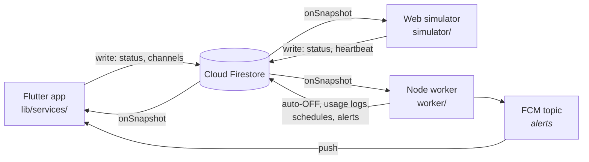

# Member 2 — Firebase & Backend

Smart Home Monitoring & Control System · SCS 3311

Everything between the user interface and the cloud: the database design, the
synchronisation mechanism, the state machine devices move through, and the
server-side rules that keep an iron from burning the house down.

---

## 1. Scope

| Mine | Not mine |
|---|---|
| Firebase project, Firestore, Auth, FCM | Floor plan screens, grid overlay, device cards |
| Collection design and security rules | Camera view UI |
| CRUD + real-time streams (`lib/services/`) | Simulator dashboard visuals |
| Device state management | |
| Usage tracking | |
| Scheduling (lights, iron) | |
| Safety auto-OFF worker + push notifications | |
| Connecting the app **and** the simulator to Firestore | |
| Testing real-time synchronisation | |

Two files sit on the boundary and are worth naming:
[lib/main.dart](../lib/main.dart) — Firebase has to initialise before the first
frame, so `bootstrapBackend()` lives there and the UI owner only changes the
`home:` line; and [lib/dev/backend_console_page.dart](../lib/dev/backend_console_page.dart)
— a deliberately plain debug screen so the backend can be built and demonstrated
before any real UI exists.

---

## 2. Architecture



Nobody talks to anybody directly. All three clients talk to Firestore, and
Firestore tells the other two. That is the whole synchronisation design, and it
is why there is no refresh button anywhere in the app.

The worker is the only privileged party: it uses the Admin SDK, which bypasses
security rules, so it can write fields no client is permitted to write.

---

## 3. Setup, from nothing

### 3.1 Firebase project

1. [console.firebase.google.com](https://console.firebase.google.com) → **Add
   project** → `smart-nest-scs3311`.
2. **Firestore Database** → *Create* → start in test mode → region
   `asia-south1`.
3. **Authentication** → *Get started* → enable **Anonymous**.
4. **Cloud Messaging** is enabled by default.

Anonymous auth is not decoration. The security rules require
`request.auth != null`, so without it every read returns permission-denied. It
gives each install a stable uid without putting a login form in front of a demo.

### 3.2 Flutter app

```bash
dart pub global activate flutterfire_cli
flutterfire configure --project=smart-nest-scs3311     # select android + web
flutter pub add firebase_core cloud_firestore firebase_auth firebase_messaging flutter_local_notifications
flutter pub get
```

`flutterfire configure` overwrites [lib/firebase_options.dart](../lib/firebase_options.dart)
— the version in the repo is a placeholder that throws a readable error if you
forget this step — and writes `android/app/google-services.json`.

> The package versions come from `flutter pub add` rather than being pinned in
> this document, so they resolve against whatever Flutter SDK the team is on.

Register the application id **`com.example.smart_nest_app`** exactly. A mismatch
here produces an app that builds and runs but never receives a notification,
with no error to explain it.

### 3.3 Rules and indexes

```bash
npm install -g firebase-tools
firebase login
firebase use --add                                   # pick the project
firebase deploy --only firestore:rules,firestore:indexes
```

### 3.4 Worker

```bash
cd worker
npm install
cp .env.example .env
# Firebase console → Project settings → Service accounts → Generate new private key
# save as worker/serviceAccount.json   (git-ignored — it bypasses all rules)
npm run seed
npm start
```

### 3.5 Simulator

```bash
cd simulator
cp firebase-config.example.js firebase-config.js     # paste the web config
npx serve .
```

---

## 4. Database design

Five collections, all flat. No subcollections: a device belongs to a floor by
`floorId`, not by nesting, so "every device in the house" is one query instead of
one per floor — and that query is what the worker listens to.

### `floors/{floorId}`

| Field | Type | Notes |
|---|---|---|
| `name` | string | "Ground Floor" |
| `level` | number | 0 = ground; orders the floor tabs |
| `planImageUrl` | string | asset path or URL of the plan image |
| `gridCols`, `gridRows` | number | size of the abstract grid over the plan |

The grid lives on the floor, not on each device, so rescaling a floor is a
one-document edit.

### `devices/{deviceId}`

| Field | Type | Notes |
|---|---|---|
| `floorId` | string | |
| `name`, `room` | string | |
| `type` | string | `outlet` · `multiswitch` · `light` · `iron` · `camera` |
| `status` | string | `ON` · `OFF` · `ERROR` · `DISCONNECTED` |
| `gridX`, `gridY` | number | cell on the floor grid |
| `channels` | array | `{index, label, isOn}` — gang boxes only |
| `maxOnDurationMinutes` | number\|null | safety budget |
| `turnedOnAt` | timestamp\|null | start of the current ON session |
| `streamUrl` | string\|null | cameras |
| `lastHeartbeat` | timestamp\|null | written by the simulator |
| `updatedBy` | string | `app` · `simulator` · `worker` |
| `statusReason` | string | `manual` · `safety_cutoff` · `schedule` · … |
| `updatedAt` | timestamp | server timestamp |

Three fields carry more weight than the rest:

**`channels`** — a five-switch gang box is *one* document with five entries, not
five documents. The spec asks for it to map to a single entity, and it keeps one
device in one cell of the grid. The unit's `status` is `ON` while any channel is
on. The cost is that updating one switch means rewriting the array, which is why
those writes run in a transaction (below).

**`turnedOnAt`** — the safety countdown is *derived* from this, never stored as
a remaining time. `turnedOnAt + maxOnDurationMinutes` is the deadline. Restart
the worker mid-session and it re-arms with the correct remaining time rather
than handing out a fresh budget. It is always written with
`FieldValue.serverTimestamp()`, so a phone with a wrong clock cannot extend its
own iron's budget.

**`updatedBy`** — three writers share this collection. Without a marker, the
simulator reacting to the app's write, and the app reacting to the simulator's
reaction, is a plausible feedback loop. It is also the nicest thing to show in a
demo: *"turned OFF by worker — safety_cutoff"*.

### `schedules/{scheduleId}`

| Field | Type | Notes |
|---|---|---|
| `deviceId` | string | |
| `channelIndex` | number\|null | targets one switch of a gang box |
| `startTime`, `endTime` | string | `"HH:mm"`, 24-hour |
| `daysOfWeek` | array | ISO: Monday 1 … Sunday 7 |
| `enabled` | boolean | |
| `lastRunAt` | timestamp | stamped by the worker |

Times are wall-clock strings, not timestamps. "Porch light on at 18:30" means
18:30 every evening, not one fixed instant. The consequence: the worker must run
in the same timezone the schedules were written in — `TZ=Asia/Colombo`.

### `usage_logs/{logId}`

| Field | Type | Notes |
|---|---|---|
| `deviceId`, `deviceName`, `floorId` | | name denormalised so reports need no join |
| `onAt` | timestamp | |
| `offAt` | timestamp\|null | **null = the session happening right now** |
| `durationSeconds` | number\|null | |
| `startedBy`, `endedBy` | string | `app` · `simulator` · `worker` · `schedule` |

### `alerts/{alertId}`

| Field | Type | Notes |
|---|---|---|
| `type` | string | `safety_cutoff` · `device_error` · `device_offline` |
| `message` | string | |
| `deviceId`, `deviceName` | string | |
| `read` | boolean | the only field a client may change |
| `createdAt` | timestamp | |

---

## 5. Synchronisation mechanism

The requirement is that a change made in the app reaches the cloud quickly, and
that a change driven externally reaches the app without a manual refresh. Both
fall out of one rule:

> **The UI never applies a state change itself. It writes to Firestore and waits
> for the snapshot to come back.**

```dart
// lib/services/device_repository.dart
Stream<List<Device>> watchByFloor(String floorId) => Refs.devices
    .where('floorId', isEqualTo: floorId)
    .orderBy('name')
    .snapshots()                                   // ← push, not poll
    .map((snap) => snap.docs.map(Device.fromDoc).toList());
```

A `StreamBuilder` on that stream repaints whenever the document changes, and it
cannot tell — or care — whether the change came from this phone, another phone,
the simulator, or the safety worker. There is no polling anywhere in the system
and no refresh control in the UI.

Toggling still feels instant despite the round trip, because Firestore's local
cache emits the change optimistically before the server acknowledges it, then
reconciles. The same cache is why a toggle made with no signal is replayed when
the connection returns —
`persistenceEnabled: true` in [app_bootstrap.dart](../lib/services/app_bootstrap.dart).

### Why writes to a gang box need a transaction

Firestore cannot update one element of an array. Updating switch 1 means
rewriting all five. Two people flipping switch 1 and switch 3 at the same moment
would each write back a copy of the array missing the other's change — one edit
silently lost. `setChannel` therefore reads and writes inside
`runTransaction`, which retries if the document moved underneath it.

### Measuring it

`simulator/sync-test.html` logs every transition with the gap between the server
write time and the moment the browser painted it. Observed on a home connection:
**150–400 ms** app → simulator. Clock skew between the two machines makes it
approximate, but it is the right order of magnitude for the report.

---

## 6. Device state management

```
        ┌──────────────── user / simulator / schedule ─────────┐
        ▼                                                      │
   ┌────────┐   toggle    ┌────────┐                           │
   │  OFF   │────────────▶│   ON   │                           │
   │        │◀────────────│        │                           │
   └────────┘   toggle    └────────┘                           │
       ▲  ▲   safety cutoff (worker) ──┘                       │
       │  │                                                    │
       │  └──── clearFault ──── ┌─────────┐ ◀── simulator ─────┘
       │                        │  ERROR  │
       │                        └─────────┘
       │
       └──── heartbeat resumes ─ ┌──────────────┐ ◀── watchdog: heartbeat lost
                                 │ DISCONNECTED │
                                 └──────────────┘
```

`ON` and `OFF` are the only states a user can reach. `ERROR` is reported by the
simulator; `DISCONNECTED` by the worker's heartbeat watchdog. Both are read-only
in the app, and both are refused as the target of a control action —
`DeviceRepository.setPower` throws `DeviceControlException` rather than writing
`ON` over a device that has stopped answering.

Recovery from `DISCONNECTED` returns to `OFF`, not to the previous state: the
system does not know what the appliance did while it was unreachable, and
guessing `ON` would be the dangerous guess.

---

## 7. Usage tracking

Sessions are written **only** by the worker, and `firestore.rules` denies
`usage_logs` to every client. Two reasons:

1. **Completeness.** The worker reacts to *status transitions*, not to button
   presses, so a device switched on from the simulator or by a schedule is
   measured exactly like one switched on from the phone. If the app wrote its own
   logs, everything that did not originate in the app would go uncounted.
2. **Integrity.** One writer means no duplicate session when two clients react to
   the same change, and usage figures that cannot be fabricated from a phone.

An open session is a document with `offAt == null`; there is at most one per
device. On startup the worker reconciles: if a device is `ON` there must be an
open session, and any session left dangling by a crash is closed at the device's
`updatedAt` — not at "now", so downtime is not billed as usage.

Reporting is aggregated client-side in `UsageRepository.summarise` — tens of
devices and hundreds of logs fold in microseconds, which is far simpler than
maintaining rollup documents, and correct by construction.

---

## 8. Scheduling

Two kinds, one mechanism:

- **Lights** — on at `startTime`, off at `endTime`, on the selected days.
- **The iron** — no window, a *budget*: `maxOnDurationMinutes` (§9).

The scheduler is **edge-triggered**: it acts on the minute a window opens and
the minute it closes, and ignores the time in between. Level-triggering — "the
window is open, so force it ON" — would make manual override impossible: switch
the porch light off at 20:00 and it would come back on twenty seconds later. As
built, your override stands until the next boundary.

The trade-off, stated plainly: if the worker is not running at 18:30, that
evening's light never comes on. `SCHEDULE_CATCHUP=true` applies windows that are
already open at startup, at the cost of overriding whatever you had set by hand.

A schedule with `channelIndex` set drives one switch of a gang box and leaves
its neighbours alone — the seeded kitchen schedule turns on the ceiling light in
the morning without starting the exhaust fan.

---

## 9. Safety cutoff

The requirement: if `max_on_duration` is breached, flip the database to `OFF`
and push an alert. It must be **server-side** — an app that has been swiped out
of the recents list cannot switch off an iron.

```js
// worker/src/safety.js — armed on every OFF → ON edge
const remaining = turnedOnAt.getTime() + budget - Date.now();
setTimeout(() => cutOff(device.id), Math.max(0, remaining));
```

The cutoff itself runs in a transaction that re-reads `turnedOnAt` and stands
down if the session it was armed for is already over — otherwise a user who
switched the iron off and straight back on could have the *old* timer cut off
their *new* session. One second of slack absorbs clock jitter between the worker
and Firestore's servers.

When it fires it writes `status: OFF`, `statusReason: safety_cutoff`,
`updatedBy: worker`, clears `turnedOnAt`, switches every channel off, appends an
`alerts` document, and pushes to FCM. The app's snapshot listener does the rest.

Seeded budget is **2 minutes** so the cutoff is watchable inside a demo video. A
real iron would be 15–30; the mechanism is identical.

---

## 10. Push notifications

The app subscribes to the topic **`alerts`** at startup; the worker sends to that
topic. Topics rather than device tokens means no token registry, no stale-token
cleanup, and no extra collection to keep in sync — and in a household, everyone
*should* hear that the iron was cut off.

The Firestore `alerts` document is the durable record; the push is only the
nudge. If the phone was off, or notification permission was denied, or Google
dropped the message, the alert is still in the feed when the app next opens.

Three things that are easy to get wrong, all handled:

- Android does not draw a notification while the app is in the foreground — it
  hands the message to the app. Without `flutter_local_notifications` re-showing
  it, the cutoff alert would only ever appear on a locked phone, which looks
  broken in a demo.
- Android 13+ needs `POST_NOTIFICATIONS` declared in the manifest *and* granted
  at runtime.
- The manifest's `default_notification_channel_id` must match the channel the
  app creates, or background alerts land on a silent low-importance channel.

---

## 11. Security rules

Deployed from [firestore.rules](../firestore.rules). The shape of it:

| Collection | Client read | Client write |
|---|---|---|
| `floors` | signed in | signed in |
| `devices` | signed in | signed in, **closed field list**, valid `status` |
| `schedules` | signed in | signed in |
| `usage_logs` | signed in | **denied** — worker only |
| `alerts` | signed in | only the `read` field |

The device update rule uses `diff().affectedKeys().hasOnly([...])`, so a client
writing an unknown field is rejected rather than silently storing it — which
keeps three separate clients honest about one schema. The worker is unaffected:
the Admin SDK bypasses rules entirely, which is precisely how a collection can be
worker-writable and client-read-only at the same time.

Test mode expires 30 days after project creation and then denies everything.
Deploy these rules before that happens, or the app stops working for reasons that
look like a code bug.

---

## 12. Integration and sync testing

### 12.1 Flutter ↔ Firestore

Run the app and open the **Backend console** (it is `home:` until the dashboard
lands). Devices appear from the seed. Toggle one, and confirm in the Firestore
console that `status`, `turnedOnAt` and `updatedBy: app` changed.

### 12.2 Simulator ↔ Firestore

`simulator/README.md` is the contract handed to the simulator's owner:
`connectSmartNest()`, `watchDevices()`, `reportPower()`, `reportChannel()`,
`reportFault()`, `startHeartbeats()`. `sync-test.html` proves the connection
before any dashboard exists.

### 12.3 Test matrix

| # | Action | Expected | ✓ |
|---|---|---|---|
| 1 | Toggle on phone | Simulator updates < 1 s, no refresh | |
| 2 | Toggle in simulator | Phone updates < 1 s, no refresh | |
| 3 | Edit `status` by hand in Firestore console | Both update | |
| 4 | Flip one switch of a gang box | Only that channel moves; unit shows `ON` | |
| 5 | Flip two channels from two clients at once | Both changes survive (transaction) | |
| 6 | Iron ON, wait past the budget | Worker writes `OFF`, alert appears, push arrives | |
| 7 | Iron OFF then straight back ON | New full budget, old timer stands down | |
| 8 | Kill and restart the worker mid-session | Countdown resumes with the correct remainder | |
| 9 | Reach a schedule `startTime` | Device switches on, `statusReason: schedule` | |
| 10 | Override a scheduled light by hand | Stays overridden until the next boundary | |
| 11 | Stop heartbeats (watchdog on) | Device goes `DISCONNECTED`; toggling is refused | |
| 12 | Airplane mode, toggle, reconnect | Write replays; both clients converge | |
| 13 | Any ON→OFF cycle | Exactly one `usage_logs` document, correct duration | |

Tests 5, 7, 8 and 12 are the ones worth demonstrating — they are where the
design decisions actually show.

### 12.4 Unit tests

```bash
flutter test
```

`test/schedule_test.dart` covers window evaluation including the overnight wrap
(22:00 → 06:00) and the day filter; `test/usage_summary_test.dart` covers
aggregation and open sessions. Neither needs Firebase.

---

## 13. Defending it

**Why is the safety cutoff not in the app?**
Because the app can be closed. A rule that protects property cannot depend on a
process the user can swipe away. It also cannot depend on the phone's clock,
which is why `turnedOnAt` is a server timestamp.

**Why is a five-switch gang box one document?**
It is one physical unit in one place on the floor plan, and the spec asks for it
to map to a single entity. The cost is array rewrites, which is why channel
writes are transactional.

**Why does the app not write its own usage logs?**
It would miss every change that did not originate in the app, and two clients
reacting to one change would write two sessions. One writer, one truth.

**Why edge-triggered schedules?**
So a manual override survives. Level-triggering would fight the user.

**What breaks if the worker is off?**
Cutoffs and schedules do not fire, and usage stops being recorded. Everything
else — control, sync, the UI — keeps working, because the worker is a
participant in the database, not a proxy in front of it. On restart it
reconciles: re-arms live timers with correct remainders and closes dangling
sessions.

**Why anonymous auth with no login screen?**
The rules need an identity to reject unauthenticated writes. Anonymous auth
supplies one without a sign-up form standing between the marker and the demo.

---

## 14. Progress checklist

- [x] Firebase project configuration → `flutterfire configure`, `firebase.json`
- [x] Firestore database design → §4
- [x] Database collections → 5, defined in `firestore_refs.dart` / `constants.js`
- [x] CRUD operations → `lib/services/*_repository.dart`
- [x] Real-time synchronisation → snapshot streams, §5
- [x] Device state management → §6, `DeviceStatus`, transactional channel writes
- [x] Usage tracking → `worker/src/usage.js` + `UsageRepository`
- [x] Scheduling (lights and iron) → `worker/src/scheduler.js`, `safety.js`
- [x] Auto OFF for safety devices → `worker/src/safety.js`
- [x] Backend worker → `worker/`
- [x] Push notifications (FCM) → `notification_service.dart`, `worker/src/notify.js`
- [x] Connect Flutter app with Firestore → `lib/services/`
- [x] Connect Web Simulator with Firestore → `simulator/smart-nest-firestore.js`
- [ ] Test real-time synchronisation → run the matrix in §12.3 and tick it

The last one needs a live Firebase project, so it is yours to run.

---

## 15. File map

```
lib/
  firebase_options.dart          generated by flutterfire (placeholder in repo)
  main.dart                      bootstrap → runApp
  models/                        document shapes + parsing
    device.dart                  DeviceType, DeviceStatus, SwitchChannel, Device
    floor.dart  schedule.dart  usage_log.dart  alert.dart  json_utils.dart
  services/
    app_bootstrap.dart           Firebase init, anonymous auth, persistence
    firestore_refs.dart          every collection path, in one place
    device_repository.dart       streams + control writes + transactions
    floor_repository.dart  schedule_repository.dart
    usage_repository.dart  alert_repository.dart
    notification_service.dart    FCM + foreground notifications
  dev/
    backend_console_page.dart    debug screen; not the app UI

worker/
  index.js                       listener, transition → usage/safety/alerts
  seed.js                        demo house
  src/  firebase safety scheduler usage heartbeat deviceControl notify constants

simulator/
  smart-nest-firestore.js        the simulator's data layer (no UI)
  sync-test.html                 sync test rig
  firebase-config.example.js

firestore.rules  firestore.indexes.json  firebase.json
test/  schedule_test.dart  usage_summary_test.dart
```
