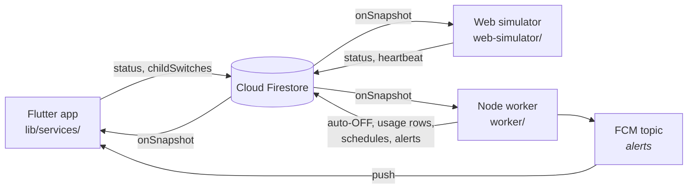

# Member 2 — Firebase & Backend

Smart Home Monitoring & Control System · SCS 3311

Everything between the user interface and the cloud: the database design, the
synchronisation mechanism, the state machine devices move through, and the
server-side rules that keep an iron from burning the house down.

---

## 1. Scope

| Mine | Not mine |
|---|---|
| Firebase project, Firestore, Auth, FCM | Screens, widgets, theme (Member 1) |
| Collection design, security rules, indexes | Simulator dashboard layout (Member 3) |
| CRUD + real-time streams | Report screen visuals |
| Device state management | |
| Usage tracking | |
| Scheduling (lights and iron) | |
| Safety auto-OFF worker + push notifications | |
| Connecting the app **and** the simulator to Firestore | |
| Testing real-time synchronisation | |

The data layer is shared, so the boundary is by *file*, not by feature:

| File | Owner |
|---|---|
| `lib/services/firestore_service.dart` | me — the only implementation of a device write |
| `lib/services/cloud_sync_service.dart` | me — screen-facing wrapper + demo fallback |
| `lib/services/alert_service.dart`, `usage_service.dart` | me |
| `lib/config/firestore_paths.dart` | me — the schema contract |
| `worker/` | me |
| `web-simulator/src/services/firebase.ts` | me |
| `lib/screens/`, `lib/widgets/` | Member 1 |
| `web-simulator/src/pages/`, `components/` | Member 3 |

---

## 2. Architecture



Nobody talks to anybody directly. All three clients talk to Firestore, and
Firestore tells the other two. That is the whole synchronisation design, and it
is why there is no refresh button anywhere in the app.

The worker is the only privileged party: it uses the Admin SDK, which bypasses
security rules, so it can write fields no client is permitted to write.

---

## 3. Setup, from nothing

### 3.1 Firebase project

1. [console.firebase.google.com](https://console.firebase.google.com) → **Add
   project**. Console appends a suffix when the name is taken, so the id you get
   is the one that matters — ours is `smart-nest-scs3311`. Put it in
   `.firebaserc`; every command below takes it.
2. **Firestore Database** → *Create* → test mode → region `asia-south1`.
3. **Authentication** → enable **Email/Password**, **Google**, *and*
   **Anonymous**.
4. **Cloud Messaging** is on by default.

Anonymous is not optional even though the app never uses it: the **web
simulator** signs in that way, and the rules reject unauthenticated reads.

### 3.2 Flutter app

```bash
dart pub global activate flutterfire_cli
flutterfire configure --project=smart-nest-scs3311  # android + web
flutter pub add firebase_messaging flutter_local_notifications
flutter pub get
```

`firebase_core`, `cloud_firestore` and `firebase_auth` are already in
`pubspec.yaml`. Register the application id **`com.example.smart_nest_app`**
exactly — a mismatch gives you an app that builds and runs but never receives a
notification, with no error to explain it.

### 3.3 Rules and indexes

```bash
npm install -g firebase-tools
firebase login
firebase use --add
firebase deploy --only firestore:rules,firestore:indexes
```

### 3.4 Worker

```bash
cd worker && npm install && cp .env.example .env
# Firebase console → Project settings → Service accounts → Generate new private key
# save as worker/serviceAccount.json   (git-ignored — it bypasses all rules)
npm run seed
npm start
```

### 3.5 Simulator

```bash
cd web-simulator && npm install && cp .env.example .env   # paste the web config
npm run dev
```

---

## 4. Database design

Five top-level collections, defined in
[`firebase/SCHEMA.md`](../firebase/SCHEMA.md): `floors`, `rooms`, `devices`,
`usage_logs`, `alerts`. Nothing is nested — a device belongs to a room by
`roomId`, which makes "every device in the house" one query, and that query is
exactly what the worker listens to.

Three decisions carry the design.

**One shared house — no `ownerId`.** Every signed-in user sees the same devices.
The alternative, scoping documents per user, would make the simulator unable to
mirror the app at all: it signs in anonymously and reads the whole `devices`
collection, so a device filtered by someone else's uid would simply not exist
for it. The worker has the same problem — it enforces safety across every device
in the project. A smart home is not a per-user inbox; the iron in the utility
room is the same iron whoever is looking at it.

**A gang box is one document.** Five switches live in `childSwitches` on a
single device — what the specification asks for, and what keeps one device in
one cell of the floor grid. The unit's `status` is `on` while any child is on.
The cost is that updating one switch rewrites the array, which is why those
writes are transactional (§5).

**`turnedOnAt` is the load-bearing field.** The safety countdown is *derived*
from it, never stored as a remaining time. Every writer — app, simulator,
worker — must maintain it identically: set it (server timestamp) only on a
genuine OFF → ON edge, never refresh it on a device already ON, clear it on OFF.
Get that wrong and the cutoff silently stops working while everything still
looks fine.

---

## 5. Synchronisation mechanism

The requirement: a change made in the app reaches the cloud quickly, and a
change driven externally reaches the app without a manual refresh. Both fall out
of one rule:

> **The UI never applies a state change itself. It writes to Firestore and waits
> for the snapshot to come back.**

```dart
// lib/services/firestore_service.dart
Stream<List<SmartDevice>> streamAllDevices() => _guarded(
      () => _devices
          .orderBy(Fields.name)
          .snapshots()                              // ← push, not poll
          .map((s) => s.docs.map(SmartDevice.fromFirestore).toList()),
    );
```

A `StreamBuilder` on that repaints whenever the document changes, and it cannot
tell — or care — whether the change came from this phone, another phone, the
simulator, or the safety worker. There is no polling anywhere in the system.

Toggling still feels instant despite the round trip, because Firestore's local
cache emits the change optimistically before the server acknowledges it, then
reconciles. The same cache replays a toggle made with no signal once the
connection returns — `persistenceEnabled: true` in
[`app_bootstrap.dart`](../lib/services/app_bootstrap.dart).

### Why gang-box writes need a transaction

Firestore cannot update one element of an array; updating switch 1 means
rewriting all five. Two people flipping switch 1 and switch 3 at the same moment
would each write back a copy missing the other's change — one edit silently
lost. `toggleChildSwitch` therefore reads and writes inside `runTransaction`,
which retries if the document moved underneath it. The simulator's
`reportChildSwitch` does the same.

### Errors are not swallowed

Every query goes through a `_guarded` helper that turns a setup failure into a
stream *error* rather than an empty stream. A missing composite index and a
permission-denied both arrive that way, and Firestore's message for a missing
index contains a link that creates it in one click. An empty stream would turn a
two-second fix into an hour of staring at a blank screen.

---

## 6. Device state management

```
        ┌──────── user / simulator / schedule ────────┐
        ▼                                             │
   ┌────────┐   toggle    ┌────────┐                  │
   │  off   │────────────▶│   on   │                  │
   │        │◀────────────│        │                  │
   └────────┘   toggle    └────────┘                  │
       ▲  ▲  safety cutoff (worker) ─┘                │
       │  │                                           │
       │  └─── clearFault ──── ┌─────────┐ ◀ simulator┘
       │                       │  error  │
       │                       └─────────┘
       │
       └─── heartbeat resumes ─ ┌──────────────┐ ◀ watchdog: heartbeat lost
                                │ disconnected │
                                └──────────────┘
```

`on` and `off` are the only states a user can reach. `error` is reported by the
simulator, `disconnected` by the worker's heartbeat watchdog. Both are refused
as the target of a control action — `toggleDevice` throws `AppException` rather
than writing `on` over a device that has stopped answering, because the UI would
then display that lie as truth.

Recovery from `disconnected` returns to `off`, not to the previous state: the
system does not know what the appliance did while it was unreachable, and `on`
is the dangerous guess.

---

## 7. Usage tracking

Written **only** by the worker; `firestore.rules` denies `usage_logs` to every
client. Two reasons:

1. **Completeness.** The worker reacts to *status transitions*, not button
   presses, so a device switched on from the simulator or by a schedule is
   measured exactly like one switched on from the phone. If the app wrote its
   own rows, everything that did not originate in the app would go uncounted.
2. **Integrity.** One writer means no duplicate row when two clients react to
   the same change, and usage that cannot be fabricated from a handset.

The log is event-shaped: one row per transition, and rows that end a session
carry the duration. Summing the `off` and `auto_off_safety` rows gives total ON
time directly — no pairing pass. Duration is stored in seconds as well as
minutes because the demo iron's budget is **two minutes**, and a report that
rounds to whole minutes cannot show that convincingly.

`UsageService.summarise` and `dailyTotals` fold the rows for the reports screen.
Aggregating on the client is deliberate: tens of devices and a few hundred rows
fold in microseconds, and there are no rollup documents to drift out of date.

---

## 8. Scheduling

Two kinds, one mechanism, both driven from fields on the device document:

- **Lights** — `scheduleStartTime` / `scheduleEndTime` / `scheduleDays`.
- **The iron** — no window, a *budget*: `maxOnDurationMinutes` (§9).

The scheduler is **edge-triggered**: it acts on the minute a window opens and
the minute it closes, and ignores the time in between. Level-triggering — "the
window is open, so force it ON" — would make manual override impossible: switch
the porch light off at 20:00 and it would come back on twenty seconds later. As
built, your override stands until the next boundary.

Stated plainly: if the worker is not running at 18:30, that evening's light
never comes on. `SCHEDULE_CATCHUP=true` applies windows already open at startup,
at the cost of overriding whatever you had set by hand.

The scheduler reads from the device cache the main listener already maintains,
so it costs no reads at all while sitting still.

---

## 9. Safety cutoff

The requirement: if `max_on_duration` is breached, flip the database to OFF and
push an alert. It must be **server-side** — an app that has been swiped out of
the recents list cannot switch off an iron.

```js
// worker/src/safety.js — armed on every OFF → ON edge
const remaining = turnedOnAt.getTime() + budget - Date.now();
setTimeout(() => cutOff(device.id), Math.max(0, remaining));
```

The cutoff runs in a transaction that re-reads `turnedOnAt` and stands down if
the session it was armed for is already over — otherwise someone who switched
the iron off and straight back on would have the *old* timer end their *new*
session. One second of slack absorbs clock jitter between the worker and
Firestore's servers.

When it fires it writes `status: off`, `statusReason: safety_cutoff`,
`updatedBy: backend_worker`, clears `turnedOnAt`, switches every child off, sets
`lastAlert`, appends an `alerts` document and pushes to FCM. Every listener does
the rest.

The seeded budget is **2 minutes** so the cutoff is watchable in a demo video. A
real iron would be 15–30; the mechanism is identical.

---

## 10. Push notifications

The app subscribes to the topic **`alerts`**; the worker sends to it. Topics
rather than device tokens means no token registry, no stale-token cleanup, and
no extra collection to keep in sync — and in a household everyone *should* hear
that the iron was cut off.

The Firestore `alerts` document is the durable record; the push is only the
nudge. If the phone was off, permission was denied, or Google dropped the
message, the alert is still in the feed when the app next opens. The push is
also sent *after* the cutoff commits and its failure is logged, not raised — a
cutoff that rolled back because a notification could not be delivered would be a
far worse bug than a missed notification.

Three things that are easy to get wrong, all handled:

- Android does not draw a notification while the app is in the foreground — it
  hands the message to the app. Without `flutter_local_notifications` re-showing
  it, the cutoff alert would appear only on a locked phone.
- Android 13+ needs `POST_NOTIFICATIONS` in the manifest *and* granted at
  runtime.
- The manifest's `default_notification_channel_id` must match the channel the
  app creates, or background alerts land on a silent low-importance channel.

---

## 11. Security rules

| Collection | Client read | Client write |
|---|---|---|
| `floors`, `rooms` | signed in | signed in |
| `devices` | signed in | signed in, **closed field list**, valid `status`, never `lastAlert`/`lastAlertAt` |
| `usage_logs` | signed in | **denied** — worker only |
| `alerts` | signed in | only the `acknowledged` field |

The device rule uses `diff().affectedKeys().hasOnly([...])`, so a client writing
an unknown field is rejected rather than silently storing it — which keeps three
separate clients honest about one schema. The worker is unaffected: the Admin
SDK bypasses rules, which is exactly how a collection can be worker-writable and
client-read-only at once.

Test mode expires 30 days after project creation and then denies everything.
Deploy these rules before that happens, or the app stops working for reasons
that look like a code bug.

---

## 12. Integration and sync testing

Run against project `smart-nest-scs3311` on 2026-08-14.

| # | Action | Expected | ✓ |
|---|---|---|---|
| 1 | Toggle on phone | Simulator updates < 1 s, no refresh | ✓ |
| 2 | Toggle in simulator | Phone updates < 1 s, no refresh | ✓ |
| 3 | Edit `status` by hand in the Firestore console | Both update | ✓ |
| 4 | Flip one child switch of a gang box | Only that switch moves; unit shows `on` | ✓ |
| 5 | Flip two children from two clients at once | Both changes survive (transaction) | ✓ |
| 6 | Iron ON, wait past the budget | Worker writes `off`, alert appears, push arrives | ✓ |
| 7 | Iron ON while already ON | Clock does **not** restart; cutoff still fires on time | ✓ |
| 8 | Iron OFF then straight back ON | New full budget; old timer stands down | ✓ |
| 9 | Kill and restart the worker mid-session | Countdown resumes with the correct remainder | ✓ |
| 10 | Reach a schedule `scheduleStartTime` | Device switches on, `statusReason: schedule` | ✓ |
| 11 | Override a scheduled light by hand | Stays overridden until the next boundary | ✓ |
| 12 | Simulate Disconnect | Phone refuses to toggle that device | ✓ |
| 13 | Airplane mode, toggle, reconnect | Write replays; both clients converge | |
| 14 | Any on→off cycle | Exactly one `usage_logs` row, correct duration | ✓ |

Tests 5, 7, 9 and 13 are the ones worth demonstrating — they are where the
design decisions actually show.

Rows 4–11 and 14 were driven from a script against the live project, so those
writes went through the Admin SDK and do not exercise `firestore.rules`. Rows
1–3 and 12 were done by hand through the app and the simulator, which do.

**Row 13 is outstanding.** To run it: in the app's Chrome tab press `F12`, then
`Ctrl+Shift+P` → **Go offline** (that tab only, so the simulator stays
connected). Toggle a device — the switch moves at once and the simulator shows
nothing. Then `Ctrl+Shift+P` → **Go online**; the simulator catches up. Chrome is
fine for this: the optimistic write and the replay come from the SDK's in-memory
queue, not from `persistenceEnabled`.

Row 12 turned up two bugs, both fixed. The app refused the toggle correctly but
said nothing, because no screen caught the `AppException` —
`lib/widgets/device_action.dart` now surfaces it. And the simulator was
heartbeating devices it had just declared unreachable, which would let the
watchdog recover them straight back out of `disconnected`.

### Unit tests

```bash
flutter test
```

`test/device_schedule_test.dart` covers window evaluation including the
overnight wrap and the safety-budget check; `test/usage_summary_test.dart`
covers aggregation, cutoff counting and daily bucketing. Neither needs Firebase.

---

## 13. Defending it

**Why is the safety cutoff not in the app?** Because the app can be closed. A
rule that protects property cannot depend on a process the user can swipe away,
nor on the phone's clock — which is why `turnedOnAt` is a server timestamp.

**Why one shared house instead of per-user devices?** Because the simulator and
the worker both operate on the whole house. Per-user scoping would leave the
simulator reading devices that, from its session, do not exist — the app and the
simulator would never see each other.

**Why is a five-switch gang box one document?** It is one physical unit in one
place on the floor plan. The cost is array rewrites, which is why those writes
are transactional.

**Why doesn't the app write its own usage logs?** It would miss every change
that did not originate in the app, and two clients reacting to one change would
write two rows. One writer, one truth.

**Why edge-triggered schedules?** So a manual override survives.

**What breaks if the worker is off?** Cutoffs and schedules do not fire and
usage stops being recorded. Everything else keeps working, because the worker is
a participant in the database, not a proxy in front of it. On restart it re-arms
live timers with the correct remaining time.

---

## 14. Known limits

- Usage is tracked per device, not per child switch. A gang box logs one session
  for the unit; "how long was the exhaust fan on?" is not answerable from the
  current schema.
- The worker runs on one machine. If the laptop sleeps, cutoffs do not fire.
- `firebase/functions_index.ts` is an earlier Cloud Functions sketch of the same
  rules. It is **not deployed** — Cloud Functions need the Blaze plan, which the
  team chose not to use. `worker/` is what runs.
